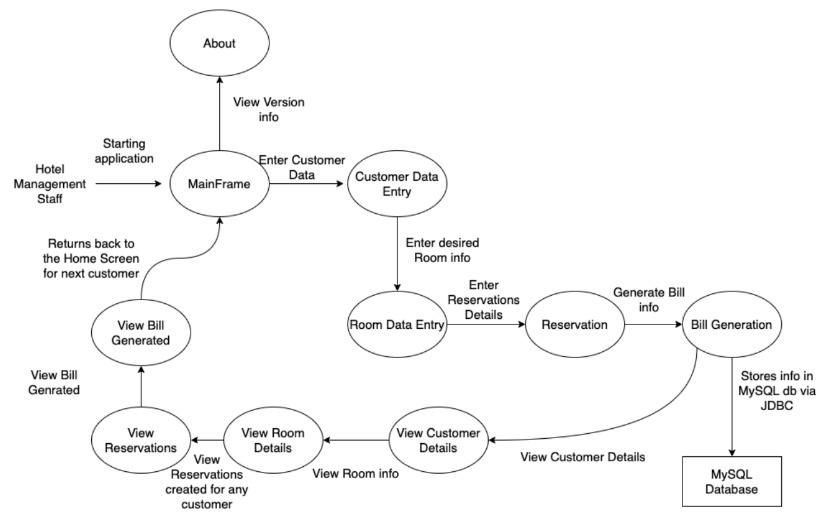

<!-- PROJECT SHIELDS -->
[![Contributors][contributors-shield]][contributors-url]
[![Forks][forks-shield]][forks-url]
[![Stargazers][stars-shield]][stars-url]
[![Issues][issues-shield]][issues-url]
[![LinkedIn][linkedin-shield]][linkedin-url]

<!-- TABLE OF CONTENTS -->

  
Table of Contents

  <ol>
    <li>
      <a href="#about-the-project">About The Project</a>
      <ul>
        <li><a href="#built-with">Built With</a></li>
      </ul>
    </li>
    <li>
      <a href="#getting-started">Getting Started</a>
      <ul>
        <li><a href="#Hardware">Hardware</a></li>
        <li><a href="#Software">Software</a></li>
      </ul>
    </li>
    <li><a href="#usage">Usage</a></li>
    <li><a href="#contributing">Contributing</a></li>
    <li><a href="#contact">Contact</a></li>
  </ol>

<!-- ABOUT THE PROJECT -->
## About The Project

Many times hotel staff face problems with respect to efficiency when customer reservations and room booking is taken into account. Difference in checkin and checkout time in a hotel by a customer do hamper the bill generation process, thereby affecting the reviews of the hotel and creating a bad image of the hotel in customers’ mind. With this project I aim to solve these problems and help the hotel staff efficiently manage customers and the process associated with them. This project also incorporates use of different screens and components for data entry, data viewing and alert actions in terms of Message Dialog boxes.

(<a href="#top">back to top</a>)

### Built With

* [JAVA 8](https://docs.oracle.com/javase/8/docs/api/)
* [MySQL 5.1](https://docs.oracle.com/cd/E19078-01/mysql/mysql-refman-5.1/)

(<a href="#top">back to top</a>)

<!-- GETTING STARTED -->
## Getting Started

Below listed **Hardware & Softwares** required to run locally this project .

### Hardware

No specific hardware requirement is presented by this project except it is compatible to
run on Windows 7, with a decent memory and storage.

### Software

With respect to Software requirements here are a few requirements which the user
must fulfil:
1. Netbeans 8.2 IDE
2. Java 8.1
3. XAMPP Server
4. MySQL 5.2
5. JDBC Connector Jar files for MySQL

(<a href="#top">back to top</a>)

<!-- USAGE EXAMPLES -->
## Usage

### DATA FLOW DIAGRAM(DFD)

   

For more information, please refer to the [Documentation](https://drive.google.com/file/d/19PT9ei7BEHr7mw2hLRs6e63Au9aYIOma/view)

(<a href="#top">back to top</a>)

<!-- CONTRIBUTING -->
## Contributing

Contributions are what make the open source community such an amazing place to learn, inspire, and create. Any contributions you make are **greatly appreciated**.

If you have a suggestion that would make this better, please fork the repo and create a pull request. You can also simply open an issue with the tag "enhancement".
Don't forget to give the project a star! Thanks again!

1. Fork the Project
2. Create your Feature Branch (`git checkout -b feature/AmazingFeature`)
3. Commit your Changes (`git commit -m 'Add some AmazingFeature'`)
4. Push to the Branch (`git push origin feature/AmazingFeature`)
5. Open a Pull Request

(<a href="#top">back to top</a>)

<!-- CONTACT -->
## Contact

Dhairya Ostwal - [@dhairyaostwal](https://twitter.com/dhairyaostwal/)

Project Link: [here](https://github.com/dhairyaostwal/Hotel-Management-System)

(<a href="#top">back to top</a>)

